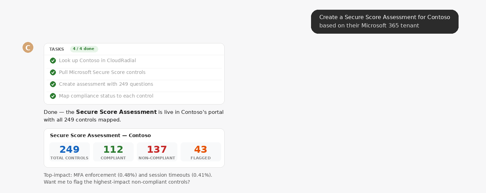
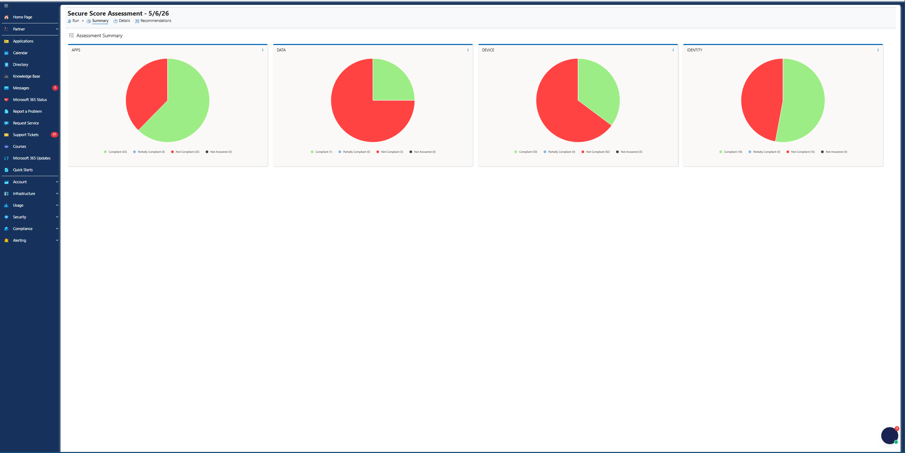

# Assessment & Compliance

> Review security assessments and track compliance — all from a chat prompt.

<table>
<tr>
<td width="50%" align="center">

**What you say**

</td>
<td width="50%" align="center">

**What shows up in the portal**

</td>
</tr>
</table>

---

## Try it

| Say this | What you get |
|---|---|
| `Show me Contoso's assessment scores` | Assessment list with status, score, and completion date |
| `How is Acme Corp doing on compliance?` | Summary across assessments — passing, failing, in progress |
| `Which company has the lowest assessment score?` | Cross-company comparison |
| `Create a Secure Score Assessment for Contoso` | Pulls M365 Secure Score controls, creates the assessment, maps compliance status |
| `Flag the highest-impact non-compliant controls for Contoso` | Sorted list of controls by score impact |

## Good to know

- **Assessments are list-only** — `get_resource` doesn't work for individual assessments (API quirk). Use `list_resources` with a filter instead.
- **Pair with [Endpoint Reporting](../endpoint-reporting)** for a full GAP picture (warranty + assessments).

## Related skills

- [Portal Setup](../portal-setup) — CSA pain-point #2 ("Improve GAP Analysis") leans on this skill.
- [Reporting & Admin](../reporting-admin) — for assessment-related archive reports.
