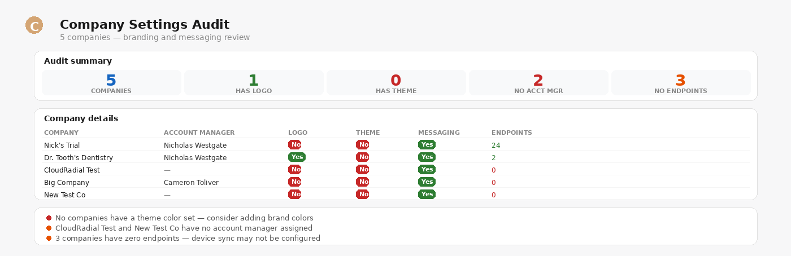

# Company Management

> Create, update, organize, and audit companies — all from a chat prompt.

**Say this:**

```
Audit all my companies for missing branding and messaging settings
```



---

## Try it

| Say this | What you get |
|---|---|
| `List all my companies` | Company names, IDs, and endpoint counts |
| `Create a new company called Acme Corp` | New company created with default settings |
| `Change the account manager for Contoso to Jane Smith` | Updated company record |
| `Which companies have no portal logo?` | Cross-company branding audit |
| `Show me all company groups` | Group list with membership counts |
| `Add Acme Corp to the "Office 365 Only" group` | Group membership updated |

## Good to know

- **`list_resources` returns limited fields** — use `get_resource` by ID for full company detail (branding, messaging, account manager).
- **Company groups use composite keys** — `company_group_company` needs both `company_group_id` and `company_id` for get/delete.
- **After creating a company**, use the [Portal Setup](../portal-setup) skill to walk through implementation.

## Related skills

- [Portal Lookup](../portal-lookup) — for company overview and meeting prep.
- [Portal Setup](../portal-setup) — for guided implementation after creating a company.
- [Reporting & Admin](../reporting-admin) — for company group reports and cross-company analytics.
