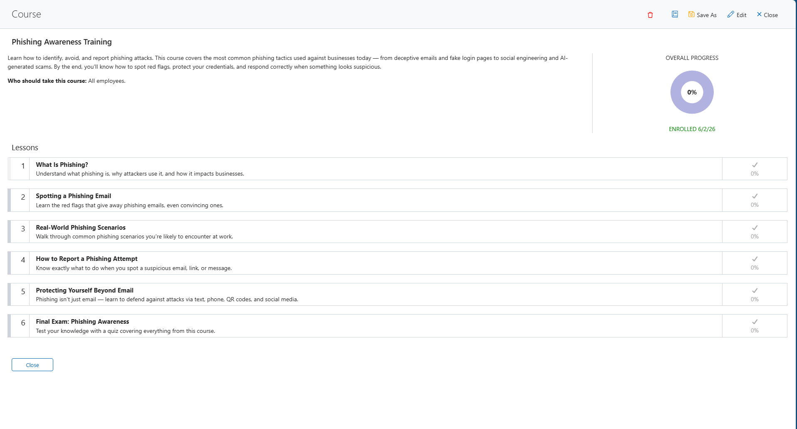

# Course Management

> Build training courses from a topic, document, or YouTube link — all from a chat prompt.

**Say this:**

```
Build a phishing-awareness training course for Contoso with 5 lessons and a final quiz
```



---

## Try it

| Say this | What you get |
|---|---|
| `Build a phishing-awareness training course for Contoso` | Full course with lessons and a final quiz |
| `Build a course from this YouTube link: <url>` | Claude summarizes the video into structured lessons |
| `Who's completed the security training at Acme Corp?` | Enrollment status with completion dates |
| `Show all courses for Contoso` | Course list with enrollment counts |
| `Who at Contoso hasn't finished their required training?` | Users with incomplete enrollments |

## Good to know

- **Course creation is two-step** — the course container is created first, then each lesson is added individually.
- **YouTube/doc/image sources** — Claude reads and summarizes the content; the plugin stores the resulting course.
- **Course uses `name`, lesson uses `title`** — different field names for the container vs. its children.

## Related skills

- [Content Management](../content-management) — for KB articles and service catalogs.
- [User Management](../user-management) — to check who's enrolled and who's completed.
