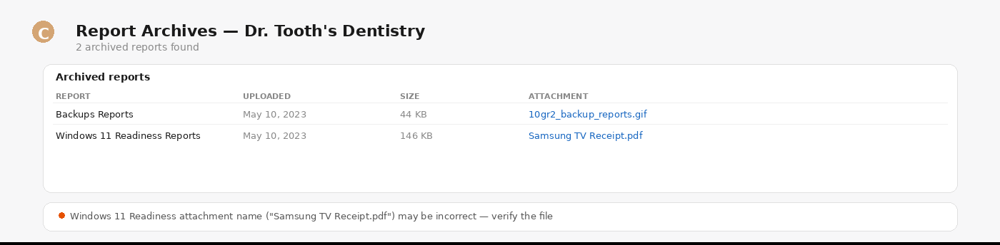

# Reporting & Admin

> Archives, certificates, company groups, API tokens, and raw API access — all from a chat prompt.

**Say this:**

```
Show me Acme Corp's archived reports
```



---

## Try it

| Say this | What you get |
|---|---|
| `Show me Acme Corp's archived reports` | List of archive items sorted by date |
| `Which of Contoso's certificates expire in 30 days?` | Filtered certificate list with expiration dates |
| `List my CloudRadial API tokens` | Active tokens with creation dates |
| `Create a new API token called 'production'` | New token generated (save it immediately) |
| `Hit /v2/odata/company/$count via the API directly` | Raw API response for advanced use cases |

## Good to know

- **`archive_item` uses a composite key** — requires both `archive_id` (folder) and `id` (item).
- **Tokens are sensitive** — record created tokens immediately; they won't be shown again.
- **`raw_api_call` is the escape hatch** — for anything the other 16 tools don't cover.

## Related skills

- [Assessment & Compliance](../assessment-compliance) — for assessment-related archive reports.
- [Endpoint Reporting](../endpoint-reporting) — for endpoint audit archives.
