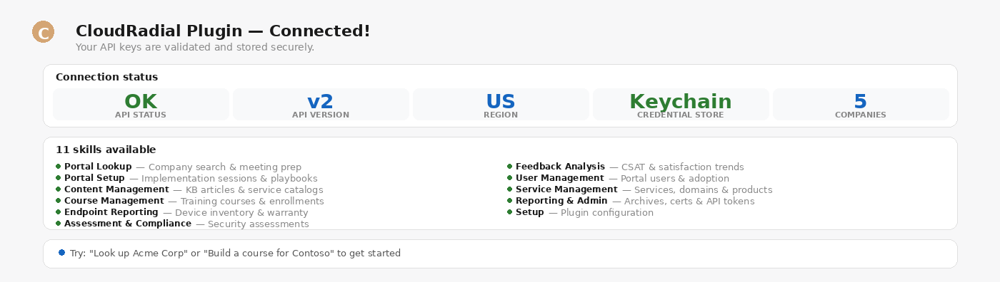

# Setup

> First-run plugin setup — validate API keys, store them securely, and tour what's possible.

**Say this:**

```
Setup the CloudRadial Plugin
```



---

## Try it

| Say this | What you get |
|---|---|
| `Setup the CloudRadial Plugin` | Guided key entry, validation, and storage |
| `Tour the plugin` | Overview of all 11 skills and what they do |
| `Is the CloudRadial plugin configured?` | Quick status check (never reveals the keys) |
| `Clear my CloudRadial credentials` | Wipes keys from the OS keychain |

## Good to know

- **One setup per machine** — keys are stored in the OS keychain and shared across Claude Desktop, Claude Code, and Cowork.
- **EU partners** should pick `https://api.eu.cloudradial.com` as the base URL during setup.
- **Keys briefly appear in chat** — for more privacy, set environment variables instead.
- **All other skills depend on this one** — if anything errors with 401/403, run setup again.

## Related skills

- Every other skill requires setup first.
- See [DEPLOYMENT.md](../../DEPLOYMENT.md) for install instructions across Claude Desktop, Claude Code, and Cowork.
